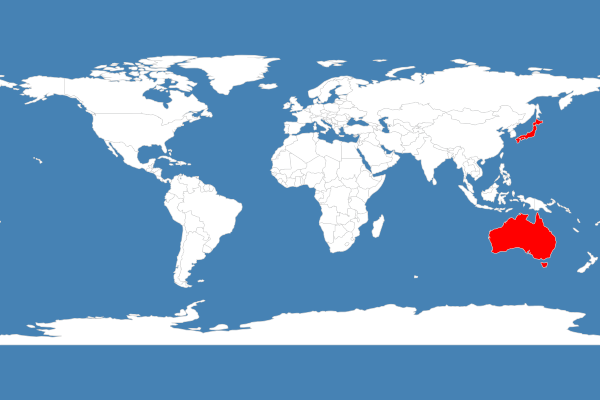

# Convert GeoJSON to image

## Usage:

```
npm install
node example1/index.js
node example2/index.js
```

## Example 1

Source data: `countries.geojson` from [here](https://github.com/datasets/geo-boundaries-world-110m) 

Converts the JSON file into XML intermediately and then renders it without any style information, uses the `[geojson-mapnikify](https://github.com/mapbox/geojson-mapnikify)` defaults which are specified in [geojson-mapnikify/lib/defaults.js](https://github.com/mapbox/geojson-mapnikify/blob/master/lib/defaults.js).

Output:


## Example 2

Source data: Same as above

Loads a stylesheet XML `countries-stylesheet.xml` file, which then fetches its data from the same `countries.geojson`. Specifies some [filters](https://github.com/mapnik/mapnik/wiki/Filter), [styling rules](https://github.com/mapnik/mapnik/wiki/SymbologySupport) and the projection.

Output:

